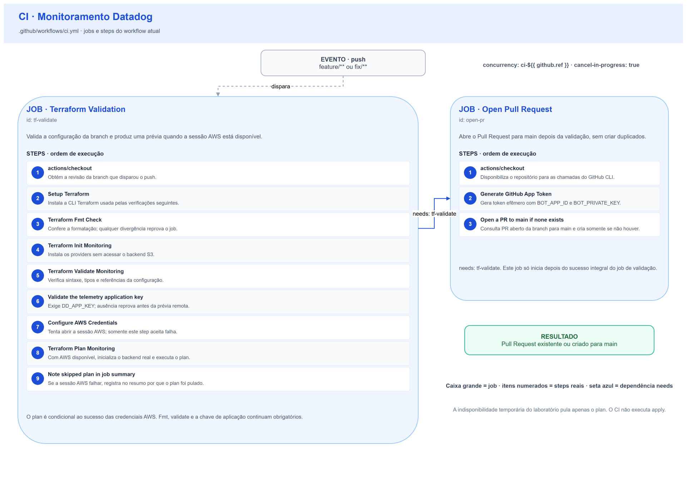
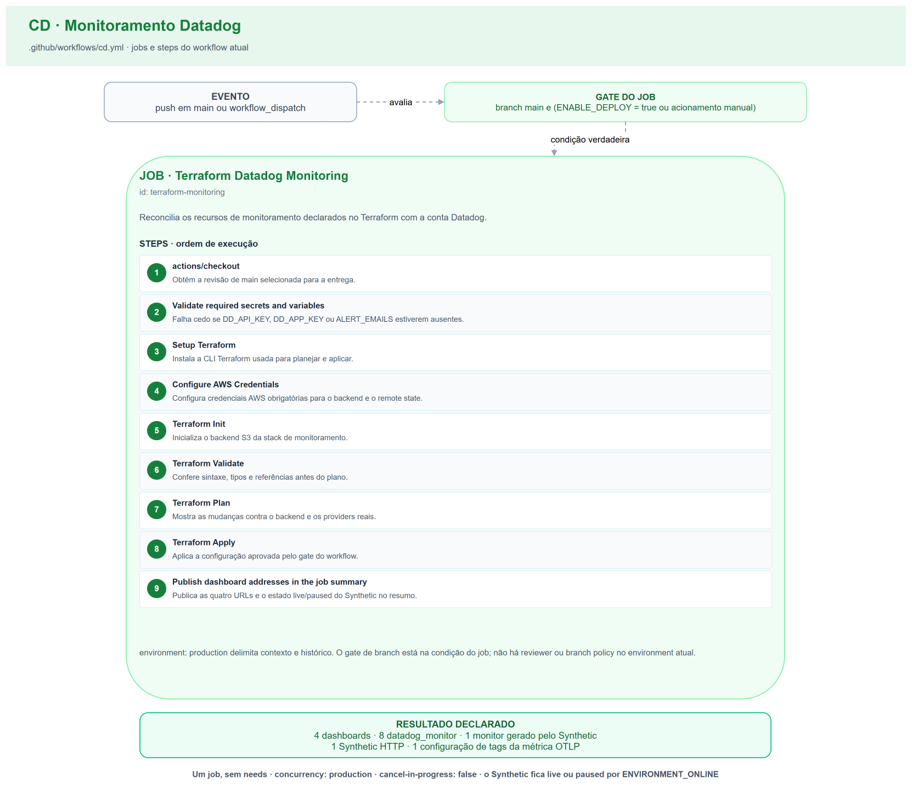

# CI/CD

Dois workflows, no mesmo padrão estrutural dos cinco outros repositórios Terraform da solução.

| Workflow | Gatilho | Arquivo |
| --- | --- | --- |
| **CI** | `push` em `feature/**` e `fix/**` | `.github/workflows/ci.yml` |
| **CD** | `push` na `main` e acionamento manual | `.github/workflows/cd.yml` |

---

## CI



```yaml
concurrency:
  group: ci-${{ github.ref }}
  cancel-in-progress: true
```

Cancela execução anterior da mesma branch: só o último push interessa.

### Job `Terraform Validation`

| # | Step no workflow | O que faz | Reprova quando |
| --- | --- | --- | --- |
| 1 | actions/checkout | Obtém a revisão que disparou o workflow; os comandos seguintes usam esse checkout. | Não consegue obter o código do repositório. |
| 2 | Setup Terraform | Instala/configura a CLI Terraform para os comandos seguintes. | A instalação/configuração da CLI falha. |
| 3 | Terraform Fmt Check | Executa `terraform fmt -check -recursive`. | Algum arquivo diverge da formatação canônica. |
| 4 | Terraform Init Monitoring | Executa `terraform init -backend=false -no-color`: instala os providers sem conectar ao backend. | A instalação dos providers falha, por indisponibilidade de registry/cache ou incompatibilidade de versão. |
| 5 | Terraform Validate Monitoring | Executa `terraform validate -no-color` com os schemas instalados. | Há inconsistência de sintaxe, tipo ou referência. |
| 6 | Validate the telemetry application key | Verifica `DD_APP_KEY` antes da autenticação AWS. | A chave está ausente; é erro de configuração, mesmo quando a prévia AWS pode ser pulada. |
| 7 | Configure AWS Credentials | Configura access key, secret key e session token da mesma sessão AWS, em us-east-1; conserva `aws_creds.outcome` para decidir entre plan e nota de skip. | **Não reprova**: este step usa `continue-on-error: true`. |
| 8 | Terraform Plan Monitoring | Só com `aws_creds.outcome == success`: executa init com backend (`-reconfigure`) e plan. | Qualquer comando de init/plan executado falha; essa falha não é tratada como skip. |
| 9 | Note skipped plan in job summary | Só com `aws_creds.outcome == failure`: registra no resumo que a prévia foi pulada. | — (nota informativa). |

**A diferença deliberada em relação aos demais stacks Terraform**: aqui o `plan` depende
de **duas** credenciais, e elas não são equivalentes.

- A **da AWS** é instável por natureza — o laboratório é ligado sob demanda e a sessão expira. A falha dela
  **não reprova**: `fmt` e `validate` já passaram e são a garantia estrutural. Padrão herdado do ADR 0003 do
  `infra-base`.
- A **do destino de telemetria** é outra coisa. A ausência dela é **erro de configuração do repositório**, não
  indisponibilidade de ambiente, e **reprova**. Sem ela não há prévia possível, e pular em silêncio seria
  enganoso: a pessoa acharia que o ambiente está fora quando na verdade falta um segredo.

**O `terraform plan` contra a API do destino é a validação específica de Datadog deste repositório.** Ele
rejeita consulta malformada, tag inexistente e widget inválido.

#### Validações extras recusadas

| Recusada | Motivo |
| --- | --- |
| `tflint`, `checkov`, `trivy config` | Nenhum outro repositório da solução usa, e nada acrescentariam sobre um provider SaaS sem superfície de rede, IAM ou criptografia |
| Validação de esquema JSON | Não haverá JSON — [ADR 0001](adr/0001-terraform-com-provider-datadog.md) |
| `datadog-ci` | Não valida definição de dashboard nem de monitor |

### Job `Open Pull Request`

Depende de `Terraform Validation`. Gera um token de GitHub App e abre um Pull Request para a `main` se ainda
não houver um aberto para a branch. Idêntico ao dos demais repositórios.

| # | Step no workflow | O que faz | Reprova quando |
| --- | --- | --- | --- |
| 1 | actions/checkout | Obtém a revisão que disparou o workflow; os comandos seguintes usam esse checkout. | Não consegue obter o código do repositório. |
| 2 | Generate GitHub App Token | Gera `app_token` com `BOT_APP_ID` e `BOT_PRIVATE_KEY`; o próximo step recebe o token como `GH_TOKEN`. | O App não consegue gerar o token, por configuração/credenciais inválidas ou falta de acesso ao repositório. |
| 3 | Open a PR to main if none exists | Consulta `gh pr list` para head → main e cria o PR só se não houver um aberto. | A consulta ou criação do PR pelo CLI falha; um PR já existente termina com sucesso. |

**Não é check obrigatório do ruleset**, deliberadamente: ele não avalia qualidade nenhuma, apenas automatiza
a abertura.

---

## CD



```yaml
concurrency:
  group: production
  cancel-in-progress: false
```

O grupo `production` serializa runs **deste repositório**; usar o mesmo nome na API e na infraestrutura não cria um lock entre repositórios. `cancel-in-progress: false` preserva o run em andamento, porque cancelar um `apply` no meio pode deixar estado parcial. Sem configuração adicional de fila, um novo run pode substituir o pendente anterior. Ver [concorrência no GitHub Actions](https://docs.github.com/en/actions/how-tos/write-workflows/choose-when-workflows-run/control-workflow-concurrency).

### Job `Terraform Datadog Monitoring`

Condicionado a estar na `main` **e** a (`ENABLE_DEPLOY == 'true'` **ou** acionamento manual). Selecionar outra branch no disparo manual pula o job.
`environment: production`, que restringe a entrega à `main` pela política de branch do environment.

| # | Step no workflow | O que faz | Reprova quando |
| --- | --- | --- | --- |
| 1 | actions/checkout | Obtém a revisão que disparou o workflow; os comandos seguintes usam esse checkout. | Não consegue obter o código do repositório. |
| 2 | Validate required secrets and variables | Verifica `DD_API_KEY`, `DD_APP_KEY` e `ALERT_EMAILS` antes de instalar/autenticar. | Qualquer item está vazio; a mensagem identifica o que falta. |
| 3 | Setup Terraform | Instala/configura a CLI Terraform para os comandos seguintes. | A instalação/configuração da CLI falha. |
| 4 | Configure AWS Credentials | Configura access key, secret key e session token da mesma sessão AWS, em us-east-1. | As credenciais estão ausentes/inválidas ou a configuração da sessão falha; não há `continue-on-error` no CD. |
| 5 | Terraform Init | Executa `terraform init -no-color`, instalando providers e configurando o backend S3 real. | A instalação dos providers ou o acesso/configuração do backend falha. |
| 6 | Terraform Validate | Executa `terraform validate -no-color`. | Há inconsistência de configuração. |
| 7 | Terraform Plan | Executa `terraform plan -no-color`; consulta providers e states necessários e mostra as alterações. | Qualquer erro de plan, incluindo acesso aos states e APIs necessários. |
| 8 | Terraform Apply | Executa `terraform apply -auto-approve -no-color`; calcula seu próprio plano, pois não há plano salvo no step anterior. | Qualquer erro ao planejar/aplicar os recursos. |
| 9 | Publish dashboard addresses in the job summary | Obtém os outputs e publica os endereços dos quatro dashboards e o estado do teste sintético no resumo do run. | A escrita do resumo no `$GITHUB_STEP_SUMMARY` falha. |

**A validação explícita de segredos vem logo após o checkout, antes de instalar ferramentas ou chamar a nuvem.** Falhar ali, com o nome do que falta, custa segundos.
Falhar no meio do `apply` deixa a conta em estado parcial. `ALERT_EMAILS` entra na validação porque, sem
destinatários, os nove monitores seriam criados corretamente e **não notificariam ninguém** — a pior falha
possível para este repositório, porque é silenciosa.

**Portão pós-entrega recusado.** Consultar a API do destino verificando o estado dos monitores após o `apply`
seria instável: um monitor legitimamente em alerta reprovaria uma entrega correta.

**A entrega falha com o laboratório fora**, e isso é correto: sem o state do gateway não há `api_endpoint`, e
sem ele não há teste sintético. Ver [Infraestrutura](terraform.md#state-remoto-consumido).

---

## Ruleset da `main`

| Regra | Configuração |
| --- | --- |
| Push direto | recusado |
| Envio forçado (`non_fast_forward`) | recusado |
| Exclusão (`deletion`) | recusada |
| Pull Request | exigido, com **zero** aprovações |
| Check obrigatório | **`Terraform Validation`**, e só ele |
| Atores com permissão de burla | **nenhum**, administradores inclusive |

Zero aprovações porque o time tem quatro pessoas e o Pull Request existe aqui para dar **visibilidade e um
lugar ao `plan`**, não para criar fila. `Open Pull Request` fica fora dos checks obrigatórios pelo motivo
descrito acima.

---

## Inventário de configuração externa

Tudo o que precisa existir fora do código. Reconfigurar o repositório do zero é percorrer esta tabela.

| # | Nome | Tipo | Escopo | Obrigatório | Finalidade | Usado em | Estado |
| --- | --- | --- | --- | --- | --- | --- | --- |
| 1 | `DD_API_KEY` | Secret | Organização | **Sim** | `provider.api_key` | CI (plan), CD (plan, apply) | ✅ configurado |
| 2 | `DD_APP_KEY` | Secret | **Repositório** | **Sim** | `provider.app_key` | CI (plan), CD (plan, apply) | ✅ configurado |
| 3 | `ALERT_EMAILS` | Variable | Repositório | **Sim** | destinatários dos nove monitores, separados por vírgula | CI, CD | ✅ configurado, 4 endereços |
| 4 | `ENABLE_DEPLOY` | Variable | Repositório | **Sim** | interruptor do CD | CD | ✅ `true` |
| 5 | `ENVIRONMENT_ONLINE` | Variable | Repositório | **Sim** | alterna o teste sintético entre `live` e `paused` | CI, CD | ✅ `false` |
| 6 | `AWS_ACCESS_KEY_ID` / `AWS_SECRET_ACCESS_KEY` / `AWS_SESSION_TOKEN` | Secrets | Organização | **Sim** no CD, opcional no CI | backend S3 e leitura do state do gateway | CI (prévia), CD | ✅ configurados na organização |
| 7 | `BOT_APP_ID` / `BOT_PRIVATE_KEY` | Variable / Secret | Organização | **Sim para abertura automática de PR** | `open-pr` gera o token sem condição; não são inputs da validação/aplicação Terraform | CI | ✅ configurados na organização |
| 8 | Environment `production` | — | Repositório | **Sim** | restringe a entrega à `main` | CD | ✅ criado, política de branch restrita à `main` |
| 9 | Ruleset da `main` | — | Repositório | **Sim** | recusa push direto, exige Pull Request | — | ✅ ativo, zero atores com burla, `Terraform Validation` obrigatório |

Conferido contra o estado real do repositório em **2026-09-09**. Os itens de escopo de organização não são
listáveis com um token de colaborador; a confirmação deles é a primeira execução verde do CI e do CD.

`DD_SITE` **não é necessário**: vira valor padrão versionado de `var.datadog_api_url`.

### Como obter a credencial do destino de telemetria

1. `Organization Settings → Service Accounts → New Service Account`. **Uma service account dedicada**, nunca
   uma chave pessoal de administrador: uma chave pessoal morre com a saída da pessoa e carrega a permissão
   dela inteira.
2. Na conta criada, `Application Keys → New Key`, com estes escopos:

   | Escopo | Para quê |
   | --- | --- |
   | `dashboards_read`, `dashboards_write` | os quatro dashboards |
   | `monitors_read`, `monitors_write` | os nove monitores |
   | `synthetics_read`, `synthetics_write` | o teste sintético |
   | `metrics_read` | leitura de metadado de métrica |
   | `metric_tags_write` | **a configuração de tags de métrica**. Não existe escopo chamado `metrics_write`; o que `POST /api/v2/metrics/{metric}/tags` exige é este. `metrics_metadata_write` é outra coisa — unidade e descrição da métrica — e não serve |
   | `timeseries_query` | **não é usado pelo Terraform.** É exigido por `GET /api/v1/query`, que é como se confirma um nome de métrica e como se lê o p95 real na calibração de limiar |
   | `logs_read_data` | mesma razão, para `POST /api/v2/logs/analytics/aggregate`: conferir uma faceta ou um valor de evento antes de escrever a consulta |

   Sem os dois últimos, o Terraform funciona e **toda verificação e calibração fica cega** — os dois endpoints
   respondem `403`.

   **Uma Application Key com escopos declarados limita o que ela pode fazer independentemente da role do
   usuário.** A service account pode ter `Datadog Admin Role` e a chave continuar recusando uma escrita que
   não esteja na lista de escopos: a role é o teto, o escopo é o que vale. O sintoma característico é `GET`
   respondendo `404` e `POST` respondendo `403` no mesmo recurso — leitura autorizada, escrita não.
3. Confirme:
   ```bash
   curl -H "DD-API-KEY: $DD_API_KEY" -H "DD-APPLICATION-KEY: $DD_APP_KEY" \
     https://api.us5.datadoghq.com/api/v2/validate_keys
   # {"status":"ok"} confirma que o par de chaves é válido
   ```
   Esse endpoint valida o par de chaves. `/api/v1/validate` verifica apenas a API key; consulte a [referência de validação de API e application keys](https://docs.datadoghq.com/api/latest/key-management/validate-api-and-application-keys/).
4. Grave como secret **de repositório** `DD_APP_KEY`.

### Passos manuais, sem automação

1. Criar a service account e a chave de aplicação (acima).
2. Criar as três variables e o environment `production` com política de branch restrita à `main`.
3. Criar o ruleset da `main`.
4. **Renovar as três credenciais AWS a cada sessão do laboratório** — elas expiram, e é o passo esquecido com
   mais frequência.
5. **Alternar `ENVIRONMENT_ONLINE` ao subir e ao derrubar o ambiente**, e reexecutar o CD.

Os passos 4 e 5 fazem parte do ritual do [Runbook](runbook.md).

### Exposições conscientemente aceitas

**`DD_APP_KEY` é secret de repositório e não de environment.** O `plan` do CI precisa dela, e segredo de
environment não é entregue a workflow de branch de trabalho. A exposição é aceita com a mesma justificativa já
documentada no repositório da Lambda, e com uma mitigação concreta: a chave é de uma **service account
dedicada com escopos mínimos**, nunca uma chave pessoal de administrador. O pior caso é alguém com acesso de
escrita ao repositório conseguir ler e escrever dashboards, monitores e testes sintéticos, além de consultar métricas e logs pelos escopos `timeseries_query` e `logs_read_data`. A lista não concede administração de cobrança ou usuários.

A alternativa endurecida — chave somente-leitura no repositório para o `plan`, chave de escrita no environment
para o `apply` — fica registrada e **não é adotada agora**: dobra o número de credenciais a renovar num time de
quatro pessoas, para proteger de um ator que já tem acesso de escrita ao código que define os mesmos recursos.

**As credenciais AWS são de organização.** Elas dão acesso ao bucket de state de toda a solução. É o modelo já
em uso nos cinco repositórios, e o laboratório é destruído ao fim de cada sessão.

---

## Solução de problemas

| Sintoma | Causa provável | O que fazer |
| --- | --- | --- |
| CI reprova em `Validate the telemetry application key` | `DD_APP_KEY` não configurado | Criar o secret de repositório — inventário acima |
| CI conclui com `Terraform plan — skipped ⏭️` no resumo | Credenciais AWS expiradas | Normal com o laboratório fora. Renovar os segredos e reexecutar para ver a prévia |
| `plan` falha com `This object does not have an attribute named "api_endpoint"` | Gateway destruído: o state existe, mas sem outputs | Subir o laboratório e entregar o gateway antes deste repositório |
| `plan` falha com `missing_aggregation :: AGG_AVG/AGG_P95` | A configuração de tags da métrica ainda não foi aplicada | É esperado na primeiríssima execução; o `depends_on` do monitor de latência cobre a ordem no `apply` |
| `apply` falha na trava do state | Outra execução em andamento | Aguardar. `cancel-in-progress: false` é proposital |
| Monitores criados e ninguém recebe e-mail | `ALERT_EMAILS` vazio ou mal formado | O CD valida antes do `apply`; conferir a variable |
| Teste sintético executando com o ambiente fora | `ENVIRONMENT_ONLINE` ficou `true` | Ajustar a variable e reexecutar o CD |
